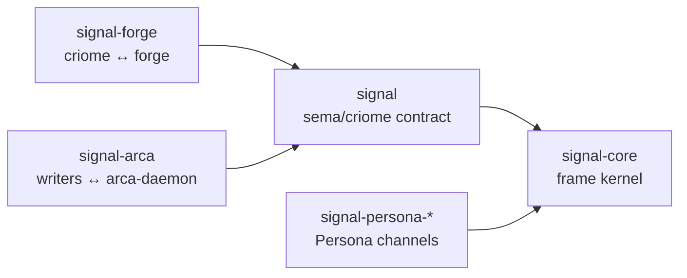

# ARCHITECTURE — signal

Signal is the **sema/criome base contract in the signal
family**. It carries the native binary form of the records
criome holds: sema records are directly computer-cognizable; the
bytes a record occupies at rest *are* its meaning, no parsing, no
interpretation. Criome IS sema's engine, so criome receives and
serves sema in its native form. Signal is that form on the wire.

The wider workspace uses **signal** as the family name for
typed inter-component communication. `signal-core` owns the
generic frame kernel; this repo owns the sema/criome request and
reply vocabulary on top of it. Persona's channel contracts follow
the same family pattern in their own `signal-persona-*` repos;
they do not add Persona payloads here.

Signal owns the sema/criome primitives — the `Frame` envelope,
handshake, auth, sema record kinds, and the front-end verbs every
criome client speaks (`Assert`, `Mutate`, `Retract`,
`AtomicBatch`, `Query`, `Subscribe`, `Validate`). Effect-bearing
wires layered atop signal — currently signal-forge for the
criome ↔ forge leg and signal-arca for the writers ↔ arca-daemon
leg — re-use signal's `Frame`, handshake, and auth, and add their
own per-verb payloads. Builder-internal churn in those layered
crates does not recompile front-end clients that depend only on
signal.

Nexus text exists as the human-facing translation. The mechanical-
translation rule (every nexus text construct has exactly one signal
form, and vice versa) keeps the two surfaces in lockstep. Inside
the nexus daemon, text-in becomes signal-out; signal-replies become
text-out.

```
text-speaking peers                  signal-speaking peers
(humans, LLM agents,                  (the nexus daemon talking
 nexus-cli, editor LSPs)              to criome — and any peer
                                       holding typed records)
        │                                       │
        │ pure nexus text                       │ length-prefixed
        │ in / out                              │ rkyv frames
        ▼                                       ▼
┌──────────────────┐                    ┌─────────────────┐
│ /tmp/nexus.sock  │                    │ /tmp/criome.sock│
│  nexus daemon    │  ──── signal ────► │     criome      │
│ (text translator)│  ◄─── signal ───── │ (validator+sema)│
└──────────────────┘                    └─────────────────┘
```

Nexus text is the only non-signal surface in the sema-ecosystem.
Once a request crosses the daemon, it is signal end-to-end.



## Boundaries

Owns:

- `Frame` envelope: `principal_hint`, `auth_proof`, `body`. No
  correlation id — replies pair to requests by **position** on
  the connection (FIFO).
- `Body { Request, Reply }`.
- `Request` enum: `Handshake`, `Assert`, `Mutate`, `Retract`,
  `AtomicBatch`, `Query`, `Subscribe`, `Validate`. `BuildRequest`
  is the next expected verb — a front-end-visible verb that
  asks criome to forward a build to forge; criome validates the
  target and forwards over signal-forge. Lands alongside
  forge-daemon.
- `Reply` enum: `HandshakeAccepted` / `HandshakeRejected`,
  `Outcome` (single-element edit reply), `Outcomes` (multi-element
  edit reply), `Records` (query result).
- `OutcomeMessage`: `Ok` (success record kind) or `Diagnostic`
  (failure record kind).
- `HandshakeRequest` / `HandshakeReply` /
  `HandshakeRejectionReason` — the protocol-version exchange
  that opens a connection.
- `ProtocolVersion { major, minor, patch }` and the
  major-exact / minor-forward compatibility rule.
- `AuthProof` (`SingleOperator` MVP, `BlsSig` and `QuorumProof`
  post-MVP skeletons).
- The **per-verb typed payloads**: `AssertOperation` /
  `MutateOperation` / `RetractOperation` / `AtomicBatch` /
  `BatchOperation` for edits; `QueryOperation` for queries;
  `Records` for typed query results. Each is a closed enum
  of typed kinds (no generic wrapper).
- The **pattern field** type: `PatternField<T>` with
  `Wildcard | Bind | Match(T)` variants, used per-field in
  `*Query` types.
- The **flow-graph kinds**: `Node`, `Edge`, `Graph` (with
  paired `NodeQuery` / `EdgeQuery` / `GraphQuery`), `Ok`,
  `RelationKind` (closed enum of 9 relation variants — Flow,
  DependsOn, Contains, References, Produces, Consumes, Calls,
  Implements, IsA). Encoding/decoding handled by the
  nota-derive
  derives — no hand-written `from_variant_name` /
  `variant_name` helpers needed. The node-kind taxonomy
  (Source / Transformer / Sink / Junction / Supervisor) belongs
  here when prism needs flow-graph records to express what each
  node *does* in the dataflow rather than only how nodes connect.
- Auxiliary types: `Diagnostic` + `DiagnosticLevel` +
  `DiagnosticSite` + `DiagnosticSuggestion`; `Slot` and
  `Revision` (private-field `u64` newtypes deriving
  `NotaTransparent` so the wire form is the bare integer
  + `From<u64>` and `From<Slot> for u64` conversions for
  ergonomic construction); `Hash` (32-byte BLAKE3 alias).

Does not own:

- Nexus text grammar or parser — see github.com/LiGoldragon/nexus.
- Sema state — owned by criome.
- Validator pipeline — owned by criome.
- Persona channel payloads — owned by `signal-persona` and the
  per-channel `signal-persona-*` contract repos.
- Runtime transport policy — owned by the daemons that use the
  contract, not by this wire crate.

## Schema discipline

Signal is the place where new typed kinds and enum variants land
as the system grows. The "no keywords" rule from the nexus
grammar applies to the **parser** only — there are no reserved
words like `SELECT` or `IF` that the parser dispatches on.
**Schema-level typed enums** (like `RelationKind { DependsOn,
Contains, … }` or `OutcomeMessage { Ok, Diagnostic }`) are
encouraged. Adding new strongly-typed kinds is the central activity
of evolving signal.

### Perfect specificity at the wire

Signal carries the project's perfect-specificity
invariant
in its concrete shape. Every verb's payload is its own closed
enum of typed kinds — `AssertOperation { Node(Node) | Edge(Edge) | … }`,
`MutateOperation { Node { slot, new, expected_rev } | … }`,
`QueryOperation { Node(NodeQuery) | … }`,
`Records { Node(Vec<Node>) | … }`. There is no shared
`KnownRecord` wrapper, no generic record envelope, no string
kind-name lookup at runtime. The wire knows what it carries by
type; consumers `match` exhaustively.

A pattern/query is itself a record kind: `NodeQuery` is paired
with `Node`, hand-written today; once `prism` lands, data and
query kinds will be projected from the same source records. The
query record carries `PatternField<T>` values using typed marker
records such as `(Bind)` and `(Wildcard)` — no parallel
"pattern" grammar exists.

No `Unknown` escape variant. The closed enum is exhaustively
closed; rebuilds bring the world forward together via the
criome self-host loop. New kinds land by adding the typed
struct + the closed-enum variant in this crate, propagating
through criome's hand-coded dispatch — schema-as-data records
are not authoritative until `prism` and a real reader exist.

## Wire format

rkyv 0.8 with the canonical pinned feature set per
lore/rust/rkyv.md:
`default-features = false, features = ["std", "bytecheck",
"little_endian", "pointer_width_32", "unaligned"]`.

Schema-as-framing: reader and writer both know the record kinds.
Frames are length-prefixed (4-byte big-endian) so a stream socket
can find frame boundaries; everything after the prefix is a rkyv
archive of `Frame`. Nothing in the bytes describes itself.

`Frame::encode` / `Frame::decode` use `rkyv::to_bytes` /
`rkyv::from_bytes` with `bytecheck` validation on read.

## Channel boilerplate

Channel boilerplate is handled conservatively. The first real
channel contracts are written by hand so the repetition is visible
before it is abstracted. A derive on a single request or reply enum
does not own a channel, because a channel is a paired request enum,
reply enum, and transport boundary.

The macro shape that fits a repeated channel is a function-style
channel macro that sees both sides of the pair. The first shared
kernel helper is smaller: a `FrameEnvelopable` marker trait in
`signal-core` can collapse repeated rkyv bound chains without any
derive macro. `signal-derive` remains outside this repo's critical
path until multiple channel contracts show the actual repetition.

## Handshake

Every connection opens with `Request::Handshake`:

1. Initiator sends `Frame { body: Request::Handshake(...) }`.
2. Server validates compatibility (major-exact, minor-forward).
3. Server replies `HandshakeAccepted` or `HandshakeRejected`.
4. On accepted: subsequent frames carry the agreed protocol
   version implicitly.

`SIGNAL_PROTOCOL_VERSION = 0.1.0`. Bump per semver.

## Reply protocol

Replies are paired to requests by **position** on the connection:
the N-th reply is for the N-th request. No correlation IDs.
Replies use the same record kinds as requests; the verb sigil
discipline carries through (`(R)` ↔ `(R)`, `~(R)` ↔ `~(R)`,
`!(R)` ↔ `!(R)`, etc.). Sequence-shaped replies (Query results)
are atomic at the position — never half-emitted; partial failure
becomes a `Diagnostic` *instead of* the sequence at that position.

For dependent edits where a later request needs the slot
assigned by an earlier one, the **client orchestrates** —
captures the assigned slot from the earlier reply (in its host
language) and substitutes it into the later request. Nexus has
no variables, no scoping, no cross-request state. For
parallelism, open multiple connections — each is its own serial
lane.

## Direct authoring — peer to nexus

Architecturally, signal is peer-shaped to nexus text:

- ✓ **Programmatic Rust clients** (services, CI, the daemon itself)
  may compose typed records directly and send them as signal
  frames — no text round-trip.
- ✗ **LLM agents** author nexus text and let the daemon translate.
  The text is the form they're trained on. Per Li 2026-04-25:
  *"not yet, not until llm models are trained using binary
  signal data."*

Both paths arrive at criome as signal frames.

## Code map

```
src/
├── lib.rs        — module entry + re-exports
├── frame.rs      — Frame envelope, encode/decode, FrameDecodeError
├── handshake.rs  — ProtocolVersion, HandshakeRequest/Reply, HandshakeRejectionReason
├── auth.rs       — AuthProof variants (BlsSignature, ...), BlsG1
├── request.rs    — Request enum (per-verb dispatch) + ValidateOperation
├── reply.rs      — Reply enum, OutcomeMessage, Records (typed per kind)
├── edit.rs       — AssertOperation / MutateOperation / RetractOperation
│                    + AtomicBatch / BatchOperation (rkyv-only for M0)
├── query.rs      — QueryOperation closed enum of typed *Query payloads
├── pattern.rs    — re-exports signal_core::PatternField
├── diagnostic.rs — Diagnostic, DiagnosticLevel, DiagnosticSite (incl. OperationInBatch),
│                    DiagnosticSuggestion, Applicability
├── slot.rs       — Slot, Revision (NotaTransparent u64 newtypes)
├── hash.rs       — Hash (BLAKE3 32-byte alias)
└── flow.rs       — Node, Edge, Graph (with paired *Query types via NotaRecord),
                    Ok, RelationKind (NotaEnum)
```

## Status

**Working core.** Wire envelope + per-verb typed payloads +
flow-graph kinds all defined and exercised. 35 tests
total — 17 wire-envelope round-trip + 18 text-format round-trip
across every verb shape, pattern, and typed `Records` reply.

## Cross-cutting context

- Project-wide architecture:
  criome/ARCHITECTURE.md
- The text-translator daemon at the boundary:
  nexus/ARCHITECTURE.md
