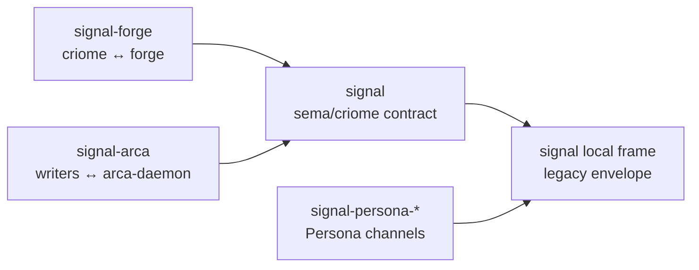

# ARCHITECTURE — signal

Signal is the **sema-ecosystem's record vocabulary** carried by this
crate's local legacy wire envelope. It carries the native binary
form of the records **criome** holds in its records database: those
records are directly computer-cognizable; the bytes a record
occupies at rest *are* its meaning, no parsing, no interpretation.
Signal is that form on the wire.

> **Scope.** "criome" throughout this doc is today's `criome` daemon
> (sema-ecosystem records validator). The eventual `Criome` is the
> universal computing paradigm in Sema; in that world, signal-* as a
> separate vocabulary layer disappears because wire and state are one
> Sema substrate. Today's signal is a realization step. See
> `~/primary/ESSENCE.md` §"Today and eventually — different things,
> different names".

Relation sentence: `signal` is the sema / criome vocabulary
relation; front-end translators and effect daemons exchange typed
sema record operations with criome through `signal` frames, while
criome owns validation, storage authority, and the slot/revision
state those operations affect.

The wider workspace uses **signal** as the family name for typed
inter-component communication. Current component contracts use
`signal-frame` as their shared frame kernel. This older `signal` crate
still owns a local `Frame` / `Request` / `Reply` envelope for the
sema/criome vocabulary until it is cut over. Reusable pattern markers
(`Bind`, `Wildcard`, `PatternField<T>`) are imported from `signal-sema`.

Signal owns the sema-ecosystem's per-verb typed payloads —
`AssertOperation`, `MutateOperation`, `RetractOperation`,
`QueryOperation`, `Records` — plus the flow-graph kinds (`Node`,
`Edge`, `Graph`, paired `*Query` types, `RelationKind`), the
auxiliary diagnostic types, and the typed `Hash` alias.
Multi-operation atomic commits still use this crate's local
`AtomicBatch` / `BatchOperation` legacy shape. Replacing that with
the current structural multi-operation Signal shape belongs to a future
cutover.

Effect-bearing wires layered around this vocabulary — currently
signal-forge for the criome-to-forge leg and signal-arca for the
writers-to-arca-daemon leg — add relation-specific payload
vocabularies. Builder-internal churn in those layered crates does not
recompile front-end clients that depend only on `signal`.

Nexus records in NOTA syntax are the human-facing translation. The
mechanical-translation rule (every Nexus NOTA record has exactly one
signal form, and vice versa) keeps the two surfaces in lockstep.
Inside the nexus daemon, NOTA-in becomes signal-out; signal-replies
become NOTA-out.

```
text-speaking peers                  signal-speaking peers
(humans, LLM agents,                  (the nexus daemon talking
 nexus-cli, editor LSPs)              to criome — and any peer
                                       holding typed records)
        │                                       │
        │ Nexus records                         │ length-prefixed
        │ in NOTA syntax                        │ rkyv frames
        ▼                                       ▼
┌──────────────────┐                    ┌─────────────────┐
│ /tmp/nexus.sock  │                    │ /tmp/criome.sock│
│  nexus daemon    │  ──── signal ────► │     criome      │
│ (text translator)│  ◄─── signal ───── │ (validator+sema)│
└──────────────────┘                    └─────────────────┘
```

Nexus's NOTA surface is the only non-signal request surface in the
sema-ecosystem. Once a request crosses the daemon, it is signal
end-to-end.



## Boundaries

Owns the **sema-ecosystem record vocabulary** carried by the local
legacy wire envelope:

- The **per-verb typed payloads** for the sema-ecosystem's verbs:
  `AssertOperation` / `MutateOperation` / `RetractOperation` for
  edits; `QueryOperation` for queries; `Records` for typed query
  results. Multi-op atomic commits still compose through this crate's
  local `AtomicBatch` payload. Each payload enum is closed (no generic
  wrapper).
- The **flow-graph kinds**: `Node`, `Edge`, `Graph` (with
  paired `NodeQuery` / `EdgeQuery` / `GraphQuery`), `Ok`,
  `RelationKind` (closed enum of 9 relation variants — Flow,
  DependsOn, Contains, References, Produces, Consumes, Calls,
  Implements, IsA). Encoding/decoding handled by `nota-next`
  derives — no hand-written `from_variant_name` /
  `variant_name` helpers needed. The node-kind taxonomy
  (Source / Transformer / Sink / Junction / Supervisor) belongs
  here when prism needs flow-graph records to express what each
  node *does* in the dataflow rather than only how nodes connect.
- Auxiliary types: `Diagnostic` + `DiagnosticLevel` +
  `DiagnosticSite` + `DiagnosticSuggestion`; `Hash` (32-byte
  BLAKE3 alias).
- The criome-side `Request` / `Reply` aliases over
  `crate::Request` / `crate::Reply`
  with the sema-ecosystem's payload types — `BuildRequest` is the
  next expected verb (asks criome to forward a build to forge over
  signal-forge; lands alongside forge-daemon).
- `OutcomeMessage`: `Ok` (success record kind) or `Diagnostic`
  (failure record kind).

External/shared pieces:

- `PatternField<T>` with the typed marker records `(Bind)` and
  `(Wildcard)` comes from `signal-sema`.
- The current shared component frame kernel is `signal-frame`; this
  crate does not use it yet.

Does not own:

- Nexus's NOTA record vocabulary or parser — see github.com/LiGoldragon/nexus.
- Criome's records database — owned by criome (criome.sema,
  managed through the sema library).
- Validator pipeline — owned by criome.
- Persona channel payloads — owned by `signal-persona` and the
  per-channel `signal-persona-*` contract repos.
- Runtime transport policy — owned by the daemons that use the
  contract, not by this wire crate.

## Schema discipline

Signal is the place where new typed kinds and enum variants land
as the system grows. The "no keywords" rule from the nexus
grammar applies to the **parser** only — there are no reserved
words like `SELECT` or `IF` that the parser dispatches on.
**Schema-level typed enums** (like `RelationKind { DependsOn,
Contains, … }` or `OutcomeMessage { Ok, Diagnostic }`) are
encouraged. Adding new strongly-typed kinds is the central activity
of evolving signal.

### Perfect specificity at the wire

Signal carries the project's perfect-specificity
invariant
in its concrete shape. Every verb's payload is its own closed
enum of typed kinds — `AssertOperation { Node(Node) | Edge(Edge) | … }`,
`MutateOperation { Node { slot, new, expected_rev } | … }`,
`QueryOperation { Node(NodeQuery) | … }`,
`Records { Node(Vec<Node>) | … }`. There is no shared
`KnownRecord` wrapper, no generic record envelope, no string
kind-name lookup at runtime. The wire knows what it carries by
type; consumers `match` exhaustively.

A pattern/query is itself a record kind: `NodeQuery` is paired
with `Node`, hand-written today; once `prism` lands, data and
query kinds will be projected from the same source records. The
query record carries `PatternField<T>` values using typed marker
records such as `(Bind)` and `(Wildcard)` — no parallel
"pattern" grammar exists.

No `Unknown` escape variant. The closed enum is exhaustively
closed; rebuilds bring the world forward together via the
criome self-host loop. New kinds land by adding the typed
struct + the closed-enum variant in this crate, propagating
through criome's hand-coded dispatch — schema-as-data records
are not authoritative until `prism` and a real reader exist.

## Wire format

This crate's local wire format is rkyv 0.8 with the canonical pinned feature set
(`default-features = false, features = ["std", "bytecheck",
"little_endian", "pointer_width_32", "unaligned"]`); 4-byte
big-endian length prefix; bytecheck validation on read.

This crate defines the typed payloads that travel inside that
wire envelope. The reader and writer both know the record kinds
because they compile against the same closed enums in this crate.

## Channel boilerplate

This crate predates the current `signal-frame` + schema-derived contract
shape. It hand-defines its local `Frame`, `Request`, and `Reply` roots and
uses `signal-derive` for record metadata. Future work should move the
criome vocabulary onto the same contract/runtime stack as the rest of the
components instead of deepening this local envelope.

## Handshake

Handshake records (`HandshakeRequest`, `HandshakeReply`,
`HandshakeRejectionReason`, `ProtocolVersion`) and the major-exact
/ minor-forward compatibility rule live in this crate's local handshake
module. Every sema-ecosystem connection opens with the local handshake:

1. Initiator sends a length-prefixed handshake frame.
2. Server validates compatibility (major-exact, minor-forward).
3. Server replies `HandshakeAccepted` or `HandshakeRejected`.
4. On accepted: subsequent frames carry the agreed protocol
   version implicitly.

The sema-ecosystem's protocol version is bumped per semver as
this crate's record vocabulary evolves.

## Reply protocol

Replies are paired to requests by **position** on the connection:
the N-th reply is for the N-th request. No correlation IDs.
Replies use typed record kinds corresponding to the request position;
the human text projection is explicit Nexus records in NOTA syntax, not
shorthand delimiter forms. Sequence-shaped replies (Query results) are atomic
at the position — never half-emitted; partial failure becomes a `Diagnostic`
*instead of* the sequence at that position.

For dependent edits where a later request needs the slot
assigned by an earlier one, the **client orchestrates** —
captures the assigned slot from the earlier reply (in its host
language) and substitutes it into the later request. Nexus has
no variables, no scoping, no cross-request state. For
parallelism, open multiple connections — each is its own serial
lane.

## Direct authoring — peer to Nexus NOTA records

Architecturally, signal is peer-shaped to Nexus records written in
NOTA syntax:

- ✓ **Programmatic Rust clients** (services, CI, the daemon itself)
  may compose typed records directly and send them as signal
  frames — no text round-trip.
- ✗ **LLM agents** author Nexus records in NOTA syntax and let
  the daemon translate. The text is the form they're trained on.
  Per Li 2026-04-25:
  *"not yet, not until llm models are trained using binary
  signal data."*

Both paths arrive at criome as signal frames.

## Code map

This crate's owned source — the sema-ecosystem record vocabulary and local
legacy envelope:

```
src/
├── lib.rs        — module entry + re-exports
├── request.rs    — Request alias + ValidateOperation
├── reply.rs      — Reply alias, OutcomeMessage, Records (typed per kind)
├── edit.rs       — AssertOperation / MutateOperation / RetractOperation
│                    (multi-op atomic commits compose via
│                    `Request` constructors)
├── query.rs      — QueryOperation closed enum of typed *Query payloads
├── diagnostic.rs — Diagnostic, DiagnosticLevel, DiagnosticSite (incl. OperationInBatch),
│                    DiagnosticSuggestion, Applicability
├── hash.rs       — Hash (BLAKE3 32-byte alias)
└── flow.rs       — Node, Edge, Graph (with paired *Query types),
                    Ok, RelationKind (nota-next codecs)
```

Local legacy envelope source — `frame.rs`, `handshake.rs`, `auth.rs`,
`slot.rs`, and `identity.rs` — still exists in this repo. `pattern.rs`
is now only a re-export of `signal-sema::PatternField`.

## Status

**Working core.** Wire envelope + per-verb typed payloads +
flow-graph kinds all defined and exercised. 35 tests
total — 17 wire-envelope round-trip + 18 text-format round-trip
across every verb shape, pattern, and typed `Records` reply.

## Cross-cutting context

- Project-wide architecture:
  criome/ARCHITECTURE.md
- The text-translator daemon at the boundary:
  nexus/ARCHITECTURE.md
